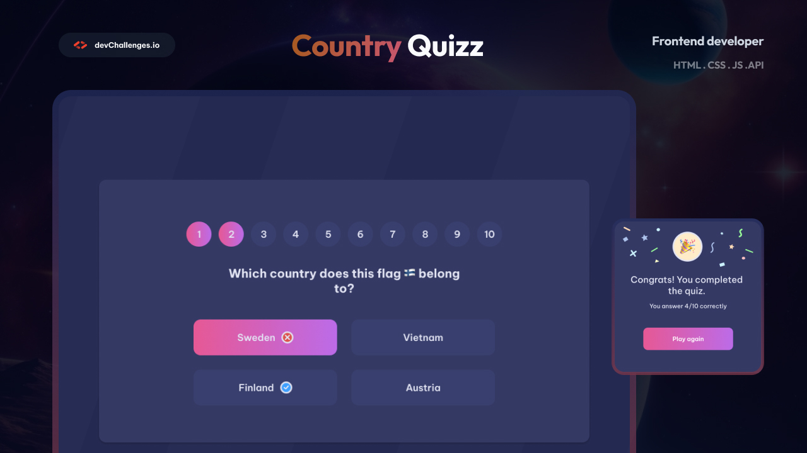

# Country Quiz App 🌍



## 🎯 Live Demo
🔗 [View Live Demo](https://country-quiz-master-five.vercel.app/)  
📦 [GitHub Repository](https://github.com/Vladimir-Sag/Country-Quiz-Master)

---

## 📝 Project Overview

An interactive quiz application that tests your knowledge of countries through flags, capitals, and coat of arms. Built with React and Next.js, fetching real-time data from REST Countries API.

**This project was completed as part of the [devChallenges.io](https://devchallenges.io/) challenge.**

---

## ✨ Features

- ✅ 10 random questions per session
- ✅ 3 question types: flags, capitals, coat of arms
- ✅ 4 answer options per question
- ✅ Instant feedback (correct/incorrect visual indicators)
- ✅ Question navigation with progress circles
- ✅ Score tracking (X/10)
- ✅ Congratulations page with replay option
- ✅ Fully responsive design (mobile → desktop)
- ✅ Clean UI with gradient accents

---

## 🛠 Technologies Used

| Category | Technologies |
|----------|--------------|
| **Frontend** | React |
| **Styling** | CSS Modules |
| **State Management** | React Hooks (useState, useEffect, useRef) |
| **API** | REST Countries API |
| **Deployment** | Vercel |

---

## 📡 API Reference

Data is fetched from **REST Countries API**:

```http
GET https://restcountries.com/v3.1/all?fields=name,capital,flags,coatOfArms